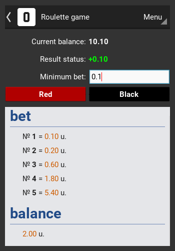

# Roulette game
Roulette with increasing rates system

## Requirements
- Python >= 3.6
- Kivy >= 1.10
- [Widgets KV](https://github.com/Paduct/widgets_kv)

## Installation
```shell
git clone https://github.com/Paduct/roulette_game
```

## Usage
### with GUI
```shell
python roulette_game
```
### from TUI
```shell
python roulette_game/src/bets.py 10 1
```
```
usage: bets.py [-h] [-c] cash min_bet

positional arguments:
  cash        current balance
  min_bet     minimum bet

optional arguments:
  -h, --help  show this help message and exit
  -c          turn color design
```

## Screenshot

